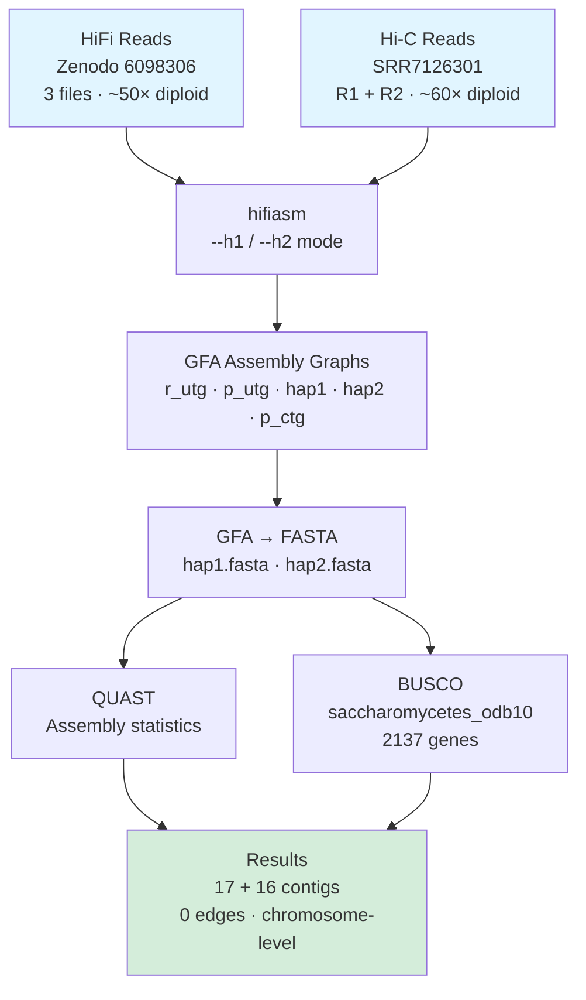

# _S. cerevisiae_ Hi-C Phased Diploid Assembly

Chromosome-level haplotype-resolved genome assembly of baker's yeast using PacBio HiFi + Hi-C data. This is the third project in a long-read assembly learning series, building on lessons from [_E. coli_ HiFi assembly](https://github.com/vikos77/ecoli-hifi-assembly) and [_Candida albicans_ diploid assembly](https://github.com/vikos77/Candida-HIFI-Assembly).

The central question this project answers: **how do you phase a diploid genome when HiFi reads alone aren't enough?**

---

## Motivation: The Problem with HiFi-Only Phasing

The [Candida assembly](https://github.com/vikos77/Candida-HIFI-Assembly) exposed a fundamental limitation of HiFi-only phasing with `--primary`:

- HiFi reads (mean ~15 kb) can phase heterozygous sites within a single read
- But long homozygous stretches break phase continuity — the assembler loses track of which allele is which
- Result: 209 fragmented contigs with haplotype switching, a mosaic of both parental chromosomes

**The fix: Hi-C data.** Chromatin contact maps link genomic regions that are physically co-located in the nucleus — even if they're megabases apart in sequence. Two loci on the same chromosome in the same cell will produce far more Hi-C read pairs than loci on different chromosomes. This provides the long-range connectivity to bridge homozygous deserts and assign sequences to the correct haplotype.

---

## Dataset

### HiFi Reads — Zenodo 6098306

Synthetic 50× diploid HiFi dataset for S. cerevisiae S288C:

| File | Coverage |
|------|---------|
| `HiFi_synthetic_50x_01.fasta` | ~17× |
| `HiFi_synthetic_50x_02.fasta` | ~17× |
| `HiFi_synthetic_50x_03.fasta` | ~17× |
| **Total** | **~50× diploid (~25× per haplotype)** |

Read length: 12–15 kb average. Source: [Zenodo record 6098306](https://zenodo.org/record/6098306)

### Hi-C Reads — SRR7126301

| Accession | SRR7126301 (NCBI SRA) |
|-----------|----------------------|
| Platform | Illumina paired-end |
| Coverage | ~60× diploid |

### Organism

**_Saccharomyces cerevisiae_ S288C** — the reference strain for yeast genomics:
- Haploid genome: ~12 Mb
- 16 nuclear chromosomes
- Heterozygosity: 0.576% (low — enough for phasing demonstration, but benign)
- Gold-standard reference genome R64-2-1 for comparison

---

## Methods



### Assembly Command

```bash
hifiasm -o yeast \
    -t 8 \
    --h1 SRR7126301_1.fastq.gz \
    --h2 SRR7126301_2.fastq.gz \
    HiFi_synthetic_50x_01.fasta \
    HiFi_synthetic_50x_02.fasta \
    HiFi_synthetic_50x_03.fasta
```

### `--primary` vs `--h1/--h2` — the critical distinction

| Flag | Extra data needed | Phasing reach | Output |
|------|-------------------|--------------|--------|
| `--primary` | HiFi only | ~read length (~15 kb) | One pseudo-haplotype + alternate fragments |
| `--h1 / --h2` | HiFi + Hi-C | Chromosome-scale (Mb) | Two fully-resolved haplotypes |

**Why `--primary` for Candida:** no Hi-C data was available.
**Why `--h1/--h2` for yeast:** both HiFi and Hi-C data were available — the right tool for the job.

### How Hi-C Enables Chromosome-Scale Phasing

The core problem: how do you connect heterozygous sites separated by 5 Mb of identical sequence when reads are only 15 kb long?

```
Haplotype A: [SNP-A]─────5 Mb homozygous─────[SNP-B]
Haplotype B: [SNP-A']────5 Mb homozygous─────[SNP-B']
```

Hi-C read pairs link loci that are physically close in 3D nuclear space. Because chromatin contacts occur preferentially within the same chromosome and same haplotype:
- Many Hi-C pairs link SNP-A ↔ SNP-B (both on haplotype A)
- Many Hi-C pairs link SNP-A' ↔ SNP-B' (both on haplotype B)
- Few pairs cross haplotypes (SNP-A ↔ SNP-B')

hifiasm maps Hi-C reads back onto the assembly graph unitigs, counts within-haplotype vs between-haplotype links, and solves a graph partitioning problem to assign each unitig to haplotype A or B — even across megabases of homozygous sequence.

---

## Results

### Assembly Graph Complexity

The difference in graph structure between Candida (HiFi-only) and yeast (HiFi+Hi-C) tells the whole story:

| Graph | Nodes | Edges | Total length | What it shows |
|-------|-------|-------|-------------|--------------|
| r_utg | 39 | 9 | 23,518,211 bp | Raw unitigs — heterozygous bubbles visible |
| p_utg | 35 | 3 | 23,483,448 bp | Spurious overlaps removed |
| hap1.p_ctg | 17 | **0** | 12,160,988 bp | Haplotype 1 — fully resolved |
| hap2.p_ctg | 16 | **0** | 11,304,582 bp | Haplotype 2 — fully resolved |
| p_ctg | 17 | 0 | 12,163,504 bp | Collapsed primary (similar to hap1) |

**0 edges in both haplotype assemblies = chromosome-level phasing success.** Every contig is a standalone chromosome or chromosome arm with no ambiguous connections. Compare to Candida's raw unitig graph: 432 nodes, 303 edges.

**Bandage visualisations:**


*r_utg.gfa — raw unitig graph: 39 nodes, 9 edges. Heterozygous bubbles visible as branching points. Much simpler than Candida (432 nodes, 303 edges) due to lower heterozygosity (0.576% vs ~60%).*


*p_utg.gfa — processed unitig graph: 35 nodes, 3 edges. Graph is nearly fully resolved after removing spurious overlaps.*


*p_ctg.gfa — collapsed primary contigs: 17 nodes, 0 edges. Chromosome-scale contigs with no ambiguous connections.*


*hap1.p_ctg.gfa — haplotype 1: 17 nodes, 0 edges, 12.16 Mb. Each node is a complete chromosome.*


*hap2.p_ctg.gfa — haplotype 2: 16 nodes, 0 edges, 11.30 Mb. One fewer contig than hap1 — see the 17 vs 16 contigs discussion below.*

### BUSCO Completeness (saccharomycetes_odb10, 2137 genes)

| Category | Hap1 | Hap2 |
|----------|------|------|
| Complete (total) | 2050 (96.0%) | 1902 (89.1%) |
| — Single-copy | 2010 (94.1%) | 1871 (87.6%) |
| — Duplicated | 40 (1.9%) | 31 (1.5%) |
| Fragmented | 57 (2.7%) | 54 (2.5%) |
| Missing | 30 (1.3%) | 181 (8.4%) |
| **Scaffolds** | **17** | **16** |
| **Total length** | **12,160,988 bp** | **11,304,582 bp** |
| **N50** | **923 kb** | **922 kb** |

### Why duplication is ~1-2%, not ~100%

A common misconception: "If haplotypes were truly separated, shouldn't every gene appear twice — 100% duplication?"

No. BUSCO runs independently on each haplotype FASTA. Each haplotype should contain each gene **once**. Low duplication (1-2%) means the assembly is clean — genes appear once per haplotype as expected. 100% duplication would indicate a tandem duplication of the entire genome within a single haplotype, which would be an assembly error.

| Context | Expected duplication | Meaning |
|---------|---------------------|---------|
| Candida `--primary` collapsed | 0-5% | Both haplotypes merged, genes appear once |
| Yeast hap1 or hap2 | 0-5% | Clean haplotype — genes appear once per haplotype ✓ |
| Assembly error | 50-100% | Whole-genome duplication within one haplotype |

### Why hap2 is less complete (89.1% vs 96.0%)

This is expected behaviour for Hi-C phasing of a low-heterozygosity genome, not an assembly failure:

1. **Coverage imbalance**: random read sampling doesn't guarantee exactly 50/50 split; the better-covered haplotype gets a higher-quality assembly
2. **Ambiguous assignment**: in regions with no distinguishing SNPs, Hi-C preferentially assigns sequences to hap1
3. **Real biological differences**: hap2 is 856 kb shorter (11.30 Mb vs 12.16 Mb), suggesting structural differences between homologous chromosomes — missing BUSCOs may reflect genuine genomic variation, not assembly gaps

Both haplotypes achieved chromosome-level contiguity (16–17 contigs, N50 ~923 kb), which is the primary goal.

### The 17th contig in hap1

S. cerevisiae S288C has 16 nuclear chromosomes. Hap1 has 17 contigs. The most likely explanation is the **rDNA repeat cluster** on Chr XII — 100–200 copies of a ~9.1 kb repeat unit that is nearly identical across both haplotypes. Assemblers routinely pull this out as a separate contig rather than embedding it within Chr XII. The alternative is a small unplaced telomeric or subtelomeric scaffold. Either way, the chromosome-scale structure is intact.

---

## Comparative Analysis: The Learning Series

| Feature | _E. coli_ | _C. albicans_ | _S. cerevisiae_ |
|---------|-----------|--------------|----------------|
| Ploidy | Haploid | Diploid | Diploid |
| Assembly mode | `--primary` | `--primary` | `--h1/--h2` (Hi-C) |
| Contigs | 1 | 209 | 17 + 16 (hap1 + hap2) |
| N50 | 4.67 Mb | 1.25 Mb | 923 kb / 922 kb |
| Graph edges (final) | 1 (circular) | 2 | 0 + 0 |
| BUSCO | 100% | 95.8% | 96.0% / 89.1% |
| Key challenge | None | Diploid heterozygosity | Long-range phasing |
| Key insight | Long reads span repeats | Diploid = fragmented | Hi-C bridges homozygous deserts |

---

## What I Learned

**Hi-C is the missing piece for diploid phasing.** Candida showed that HiFi reads alone can't phase a diploid genome — you lose track of which allele is which across homozygous stretches longer than read length. Adding Hi-C changes the problem entirely by providing megabase-scale linkage information. The 432-node Candida graph vs the 0-edge yeast haplotype graphs makes this concrete.

**Assembly graph edges are a phasing quality metric.** Before this project I thought of N50 as the main assembly quality number. After looking at Bandage graphs across all three projects, I now treat the number of remaining edges in the final contig graph as equally important — 0 edges means every contig is unambiguously placed, which is what chromosome-level means in practice.

**BUSCO duplication measures collapse, not phasing.** The 0.7% duplication in Candida proved the primary assembly was heavily collapsed (both haplotypes merged). The 1.5-1.9% in each yeast haplotype proved the haplotypes were genuinely separated. Understanding this distinction changes how you interpret BUSCO output for diploid assemblies.

**Hap1 ≠ Hap2 biologically.** The 856 kb size difference and 181 additional missing BUSCOs in hap2 reflect real genomic differences between homologous chromosomes — structural variants, copy number differences, rDNA copy number. It is not evidence that the assembly failed. This is what actual diploid genomes look like when you stop collapsing them.

---

## Technical Details

**Software versions**

| Tool | Version | Purpose |
|------|---------|---------|
| hifiasm | 0.21.0 | Assembly with Hi-C phasing |
| seqkit | 2.12.0 | HiFi read statistics |
| NanoPlot | 1.46.2 | HiFi read QC visualisation |
| FastQC | 0.12.1 | Hi-C read QC |
| QUAST | 5.3.0 | Assembly statistics |
| BUSCO | 5.5.0 | Gene completeness |
| Bandage | latest | Assembly graph visualisation |

**Installation**

```bash
conda env create -f longread_assembly_hic.yaml
conda activate longread-assembly-hic
```

**Computational requirements**

| Resource | Value |
|----------|-------|
| Platform | Linux (Ubuntu) |
| CPU | 8 threads |
| RAM | ~16 GB |
| Storage | ~10 GB (including raw data) |
| Runtime | ~1–2 hours |

---

## Repository Structure

```
yeast-hifi-hic-assembly/
├── README.md
├── longread_assembly_hic.yaml    # conda environment
├── TROUBLESHOOTING.md
├── .gitignore
├── scripts/
│   ├── 01_download.sh            # Zenodo + SRA download
│   ├── 02_qc.sh                  # seqkit + NanoPlot (HiFi) + FastQC (Hi-C)
│   ├── 03_assembly.sh            # hifiasm --h1/--h2 + GFA→FASTA
│   └── 04_assessment.sh          # QUAST + BUSCO (both haplotypes)
├── results/
│   ├── qc/
│   │   ├── hifi_stats.txt
│   │   ├── hifi_nanoplot/
│   │   └── hic_fastqc/
│   ├── assembly/                 # GFA and FASTA files (gitignored)
│   └── assessment/
│       ├── quast/
│       ├── busco_hap1/
│       └── busco_hap2/
└── figures/
    └── *.png                     # Bandage assembly graph screenshots
```

## Running the Analysis

```bash
conda activate longread-assembly-hic
cd scripts

bash 01_download.sh     # Download HiFi (Zenodo) + Hi-C (SRA)
bash 02_qc.sh           # QC both data types
bash 03_assembly.sh     # hifiasm Hi-C phased assembly
bash 04_assessment.sh   # QUAST + BUSCO on hap1 and hap2
```

---

## Part of a Learning Series

1. [**_E. coli_ HiFi Assembly**](https://github.com/vikos77/ecoli-hifi-assembly) — Haploid bacterium, 1 contig, 100% BUSCO
2. [**_Candida albicans_ Diploid Assembly**](https://github.com/vikos77/Candida-HIFI-Assembly) — Diploid fungus, HiFi-only `--primary`, 209 contigs, 95.8% BUSCO
3. **_S. cerevisiae_ Hi-C Phased Assembly** (this repo) — Diploid yeast, HiFi+Hi-C, 17+16 contigs, chromosome-level, 96%/89% BUSCO
